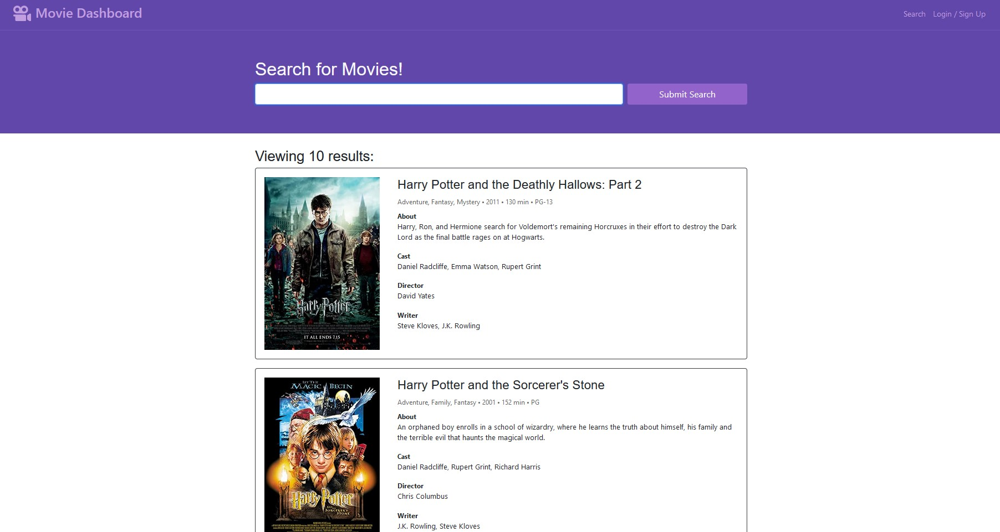

# Movie Dashboard

## Purpose
A movie search engine built with a RESTful API and MERN stack.  Users can create accounts and save their favorite movies, which is stored in a MongoDB database.  Deployed through Heroku.

## Link
https://blooming-stream-54961.herokuapp.com/

## Screenshot

## Built With
* MongoDB
* Express.js
* React.js
* Node.js

## Contribution
Made with ❤️ by Deleon Haley, Joshua Ramat, Te Wei
